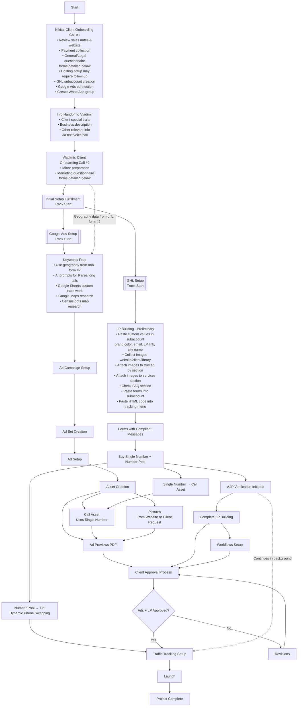

# Client Onboarding Process - GHL LP Fulfillment

## Overview
This document captures the systematic process for onboarding new SignFlow clients using GoHighLevel (GHL) Landing Page fulfillment. This process ensures consistency, quality, and efficiency in client delivery.

## Process Flow Diagram

## Questionnaire Details

### Call #1 - General/Legal Questionnaire (Nikita)
**Client Information & Legal Setup**
- First Name
- Last Name
- Legal Entity Name
- Personal Email
- Business Name
- State/Province/Region
- Business Email
- Street Address
- City
- Zip/Postal Code
- Country
- Business Phone Number
- WhatsApp Number
- Website
- EIN (Employer Identification Number)
- Document for Google Advertiser Verification (IRS-issued letters, CP 575, Forms 8871/8872)

### Call #2 - Marketing Questionnaire (Vladimir)
**Campaign Strategy & Business Details**
- Business Name
- All service offerings (or what do not offer - awnings, wraps, wooden, etc.)
- 1st priority service to be advertised
- 2nd priority service to be advertised
- Comparative advantages of your business
- Offer for ad campaign (10% off, on-site visit, same day quote, consultation, etc.)
- Areas served (geography)
- Comments on geography
- Where to take images/videos from? (website or direct sharing)
- Same day quote availability? (noting marketing limitations)
- Warranty terms (up to X years)
- Ad schedule preferences (Mon-Fri / Mon-Sun / custom)
- Additional comments

## Process Steps Detail

### Phase 1: Client Onboarding Calls
1. **Nikita: Client Onboarding Call #1**
   - Payment collection
   - **General/Legal Questionnaire** (see details below)
   - Hosting setup
   - GHL subaccount creation
   - Google Ads account connection

2. **Info Handoff to Vladimir**
   - Sales process information transfer
   - Call #1 insights and data
   - Client requirements summary

3. **Vladimir: Client Onboarding Call #2 (Marketing Onboarding)**
   - **Marketing Questionnaire** (see details below)
   - Strategy discussion and planning
   - Campaign objectives definition

### Phase 2: Initial Setup Fulfillment (Concurrent Tracks)

#### Google Ads Setup Track
4. **Keywords Preparation**
   - Keyword research and selection
   - Competitive analysis
   - Keyword grouping and organization

5. **Ad Campaign Setup**
   - Campaign structure creation
   - Targeting parameters
   - Budget and bidding strategy

6. **Ad Set Creation**
   - Audience definition
   - Placement optimization
   - Scheduling configuration

7. **Ad Setup**
   - Ad copy creation
   - Call-to-action optimization
   - Landing page integration

8. **Asset Creation**
   - **Call Asset**: Uses single number purchased
   - **Pictures**: Sourced from website or requested from client
   - Additional creative assets as needed

9. **Ad Previews PDF Creation**
   - Comprehensive ad preview document
   - Ready for client approval

#### GHL Setup Track
10. **Preliminary LP Building**
    - Basic landing page structure
    - Initial design implementation
    - Core functionality setup

11. **Forms with Compliant Messages**
    - Lead capture forms creation
    - Compliance messaging integration
    - Form validation setup

12. **Number Purchasing**
     - **Single Number**: For Google Ads call asset
     - **Number Pool**: For LP dynamic phone swapping and tracking

13. **A2P Verification Initiated**
    - Application-to-Person verification process
    - Compliance documentation
    - Carrier approval process

14. **Complete LP Building**
    - Final design implementation
    - Content optimization
    - User experience refinement

15. **Workflows Setup**
    - Automation sequences
    - Lead nurturing flows
    - Follow-up processes

### Phase 3: Approval & Launch
16. **Client Approval Process**
    - Ad previews PDF review
    - Landing page evaluation
    - Feedback collection and implementation

17. **Traffic Tracking Setup**
    - Dynamic phone number integration
    - Conversion tracking implementation
    - Analytics configuration

18. **Launch**
    - Google Ads campaign activation
    - Landing page goes live
    - All systems operational

### Phase 4: Project Completion
19. **Post-Launch Monitoring**
    - Initial performance review
    - System stability verification
    - Client handoff completion

## Quality Checkpoints

### Design Approval Gates
- [ ] Brand compliance verified
- [ ] Visual hierarchy optimized
- [ ] Mobile responsiveness confirmed
- [ ] Loading speed acceptable

### Technical Validation
- [ ] All forms functioning
- [ ] Tracking pixels installed
- [ ] Analytics configured
- [ ] SSL certificate active

### Client Readiness
- [ ] Training completed
- [ ] Documentation provided
- [ ] Support processes established
- [ ] Success metrics defined

## Tools & Resources

### Primary Tools
- **GoHighLevel**: Main platform for LP development
- **Figma/Canva**: Design assets
- **Google Analytics**: Performance tracking
- **PageSpeed Insights**: Performance optimization

### Documentation Templates
- Client intake questionnaire
- Design brief template
- Testing checklist
- Handoff documentation

## Success Metrics

### Time Efficiency
- Target completion: 5-7 business days
- Client feedback cycles: Max 2 rounds
- Testing phase: 1-2 days

### Quality Standards
- Page load speed: <3 seconds
- Mobile responsiveness: 100%
- Conversion optimization: A/B tested
- Client satisfaction: 90%+ approval

## Continuous Improvement

### Regular Review Points
- Monthly process evaluation
- Client feedback analysis
- Tool efficiency assessment
- Team skill development

### Process Optimization
- Template refinement
- Automation opportunities
- Quality enhancement
- Time reduction strategies

---

## Version History

### v1.0.0 - 2025-07-06
- **Major**: Initial process documentation created
- **Minor**: Captured current GHL LP fulfillment workflow
- **Patch**: Established baseline for process improvement

---

*Note: This process documentation is based on the current intuitive workflow and should be refined through practical application and team feedback.* 