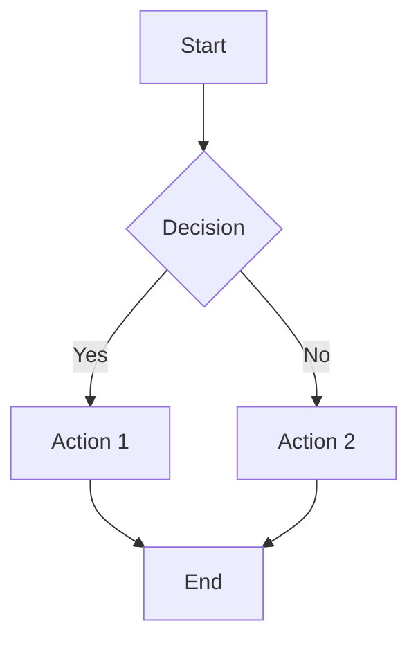
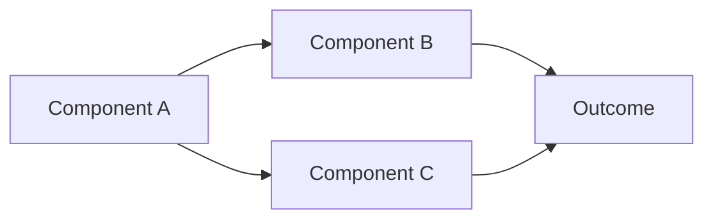
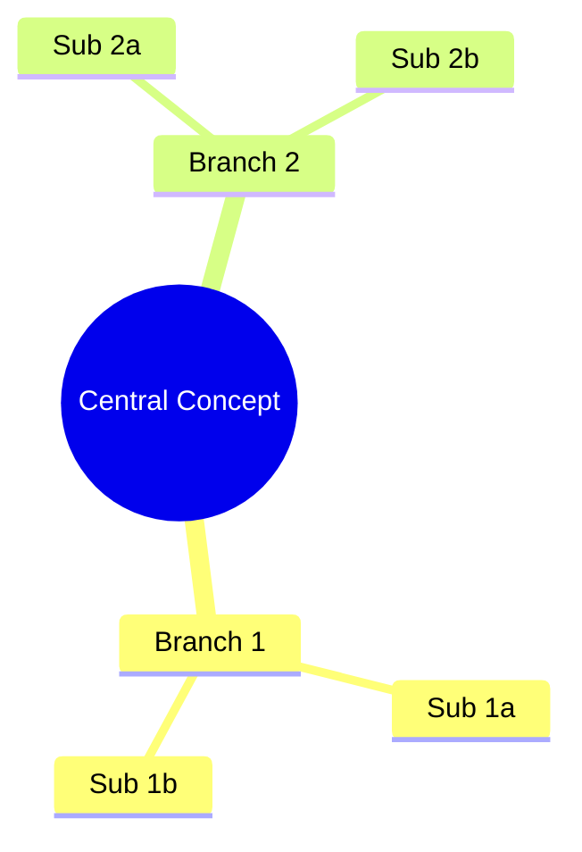

# Concept Documentation & Interview Process

## Purpose

This process enables thorough documentation of complex concepts, processes, and mental models through structured interviews that result in comprehensive charts and notes.

## Process Overview

### Phase 1: Initial Concept Introduction
**Your Role:**
- Provide initial description of the concept/process
- Give context and scope
- Mention any key elements you already know

**My Role:**
- Listen and identify key components
- Note potential areas for deeper exploration
- Prepare targeted questions

### Phase 2: Structured Interview
**My Role:**
- Conduct systematic questioning to uncover:
  - **Components**: What are the main elements/parts?
  - **Relationships**: How do elements connect/influence each other?
  - **Sequence**: What's the order/flow of the process?
  - **Conditions**: When/why do different paths occur?
  - **Outcomes**: What are the results/endpoints?
  - **Context**: What external factors matter?
  - **Edge Cases**: What unusual scenarios exist?

**Your Role:**
- Provide detailed explanations
- Give examples and counter-examples
- Clarify relationships and dependencies
- Correct any misunderstandings

### Phase 3: Synthesis & Chart Creation
**My Role:**
- Create Mermaid diagram capturing the full concept
- Write accompanying notes explaining key insights
- Ask for feedback and refinements

**Your Role:**
- Review accuracy and completeness
- Request modifications or additions
- Approve final version

## Question Categories

### Structure Questions
- "What are the main components of this process?"
- "How would you break this down into stages/phases?"
- "What are the key decision points?"

### Relationship Questions
- "How does X influence Y?"
- "What triggers this step?"
- "What are the dependencies here?"

### Context Questions
- "When does this process typically occur?"
- "What external factors affect this?"
- "Who are the key stakeholders/actors?"

### Depth Questions
- "Can you give me a specific example?"
- "What happens if X fails?"
- "How do you know when this step is complete?"

### Boundary Questions
- "Where does this process start and end?"
- "What's outside the scope of this concept?"
- "How does this relate to [similar concept]?"

## Chart Creation Standards

### Preferred Format: Mermaid Diagrams

**For Processes:**


**For Concepts/Relationships:**


**For Hierarchies:**


### Accompanying Documentation
Each chart should include:
- **Context**: What this represents and why it matters
- **Key Insights**: Important patterns or relationships discovered
- **Applications**: How this knowledge can be used
- **Related Concepts**: Links to other vault content

## Session Types

### Process Documentation
**Goal**: Map out how something works step-by-step
**Focus**: Sequence, decision points, inputs/outputs
**Example**: "How I make investment decisions"

### Concept Mapping
**Goal**: Understand relationships between ideas
**Focus**: Connections, hierarchies, influences
**Example**: "My personal productivity system"

### Mental Model Extraction
**Goal**: Capture how you think about something
**Focus**: Frameworks, heuristics, patterns
**Example**: "How I evaluate people"

### System Analysis
**Goal**: Document complex systems and their components
**Focus**: Structure, interactions, feedback loops
**Example**: "My knowledge management workflow"

## Initiation Protocol

### Simple Format
```
CDP session: [Type] - [Topic]. [Scope].
```

### Type Options
- **Process Documentation** - Step-by-step workflows
- **Concept Mapping** - Relationships between ideas
- **Mental Model Extraction** - How you think about something  
- **System Analysis** - Complex systems and components

### Scope Options
- **Full scope** - Complete comprehensive mapping
- **High-level only** - Main components and relationships
- **Specific component** - Focus on one particular aspect
- **Decision points** - Focus on choice/branching logic
- **Workflow only** - Just the sequence/flow

### Examples
- `CDP session: Process Documentation - How I choose what to learn next. Full scope.`
- `CDP session: Mental Model Extraction - How I evaluate people. High-level only.`
- `CDP session: System Analysis - My morning routine. Decision points.`

### Alternative Detailed Format
If you prefer more context, you can also provide:
1. **Session Type**: Which type from above
2. **Topic**: What concept/process we're documenting  
3. **Scope**: How broad/narrow you want to go
4. **Context**: Why this matters to you

## Quality Standards

### Complete Documentation Includes:
- All major components identified
- Relationships clearly mapped
- Decision criteria explained
- Edge cases considered
- Context and constraints noted

### Chart Quality Markers:
- Clear visual flow
- Appropriate level of detail
- Consistent terminology
- Logical groupings
- Easy to follow paths

## Benefits

1. **Externalize Knowledge**: Get tacit knowledge out of your head
2. **Identify Gaps**: Discover missing steps or unclear logic
3. **Optimize Processes**: Find improvement opportunities
4. **Create References**: Build reusable decision frameworks
5. **Share Understanding**: Make your thinking accessible to future you

## Usage Examples

**Quick Reference:**
> "CDP session: Mental Model - How I evaluate business opportunities. Full scope."

**Detailed Request:**
> "I want to document my process for choosing what books to read. It's a Process Documentation session. I realize I have an intuitive system but want to make it explicit so I can improve it and be more consistent."

---
## Version History

### v1.0.0 - 2025-01-30
- **Major**: Initial concept documentation and interview process creation
- Established structured interview methodology
- Defined chart creation standards using Mermaid
- Created session types and initiation protocols
--- 