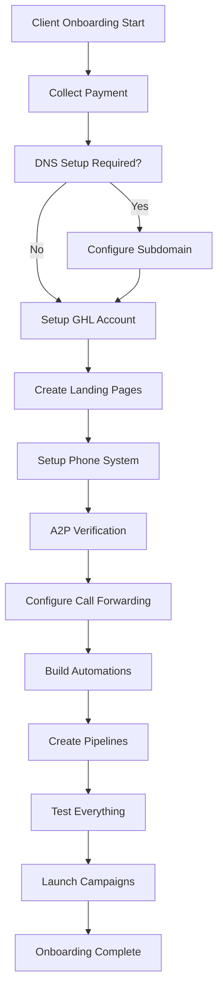
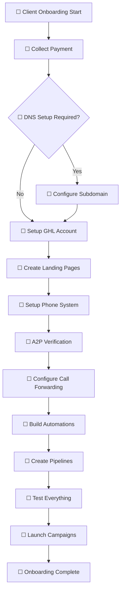
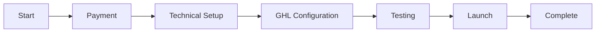

# Test - SOP Flowchart with Checkboxes

## Method 1: Mermaid Flowchart + Checklist Below

### Process Visualization

### Corresponding Task Checklist
- [ ] **Payment Collection** - Collect first month payment and ad spend
- [ ] **DNS Configuration** - Help client setup subdomain records
- [ ] **GHL Account Setup** - Create and configure GoHighLevel account
- [ ] **Landing Page Creation** - Customize templates for client's business
- [ ] **Phone System** - Purchase phone number for client
- [ ] **A2P Verification** - Complete carrier verification process
- [ ] **Call Forwarding** - Setup forwarding to client's main number
- [ ] **Automation Building** - Create lead nurturing automations
- [ ] **Pipeline Creation** - Setup sales pipeline in GHL
- [ ] **System Testing** - Test all components end-to-end
- [ ] **Campaign Launch** - Go live with Google ads
- [ ] **Final Review** - Confirm everything working properly

---

## Method 2: Inline Flowchart with Checkboxes

*Note: Checkboxes in Mermaid are visual only - not interactive*

---

## Method 3: Hybrid Approach (RECOMMENDED)

### Quick Reference Flowchart

### Detailed Task Breakdown with Progress Tracking

#### Phase 1: Payment & Initial Setup
- [ ] Collect first month retainer fee
- [ ] Collect ad spend budget
- [ ] Send welcome email with next steps
- [ ] Schedule technical onboarding call

#### Phase 2: Technical Configuration  
- [ ] Check if DNS access needed
- [ ] Configure subdomain records (if required)
- [ ] Create GHL account for client
- [ ] Setup account permissions and access

#### Phase 3: GHL System Building
- [ ] Customize landing page templates
- [ ] Purchase and configure phone number
- [ ] Complete A2P verification process
- [ ] Setup call forwarding rules
- [ ] Build lead capture automations
- [ ] Create sales pipeline stages
- [ ] Configure email/SMS sequences

#### Phase 4: Testing & Quality Assurance
- [ ] Test landing page functionality
- [ ] Verify phone system works
- [ ] Check automation triggers
- [ ] Test pipeline progression
- [ ] Run end-to-end lead flow test

#### Phase 5: Campaign Launch
- [ ] Create Google Ads account (if needed)
- [ ] Setup search campaigns
- [ ] Configure Performance Max campaigns  
- [ ] Set budget and targeting
- [ ] Launch campaigns live
- [ ] Monitor initial performance

#### Phase 6: Completion & Handoff
- [ ] Document account access details
- [ ] Provide client training materials
- [ ] Schedule first check-in call
- [ ] Move to ongoing management phase

---

## Method 4: Canvas Alternative

For visual process mapping, you could also use **Obsidian Canvas**:
- Drag and drop boxes for each step
- Connect with arrows
- Embed actual notes as process steps
- More flexible visual layout
- Can include images, files, links

---

## Usage Instructions

### For Each New Client:
1. **Copy this entire note** (or create template)
2. **Rename** with client name: `"ClientName - Onboarding SOP"`
3. **Work through checklist** checking off completed items
4. **Add client-specific notes** under each section
5. **Archive** when complete

### Template Customization:
- Add time estimates for each task
- Include responsible person assignments
- Add links to specific tools/resources
- Customize steps based on client type

---

## Recommendation

**Best approach**: **Method 3 (Hybrid)** because:
- ✅ Visual flowchart shows overall process
- ✅ Interactive checkboxes for actual task tracking  
- ✅ Detailed breakdown prevents missed steps
- ✅ Easy to copy and customize per client
- ✅ Works well with Obsidian's task management
- ✅ Can add notes/comments for each client

**Alternative**: If you prefer more visual control, use **Obsidian Canvas** for the flowchart and link to a markdown checklist note.

---
## Version History

### v1.0.0 - 2025-01-30
- **Major**: Initial test implementation of SOP flowchart with checkboxes
- Demonstrated multiple approaches for process visualization and task tracking
- Provided usage instructions and recommendations
--- 